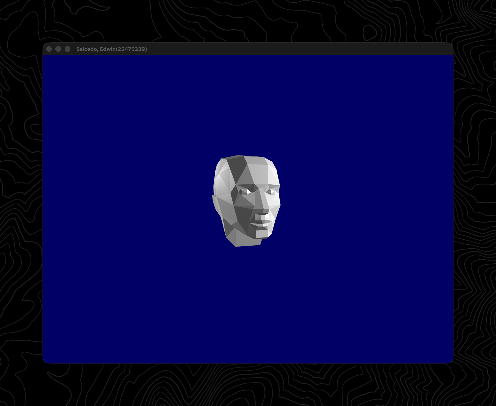
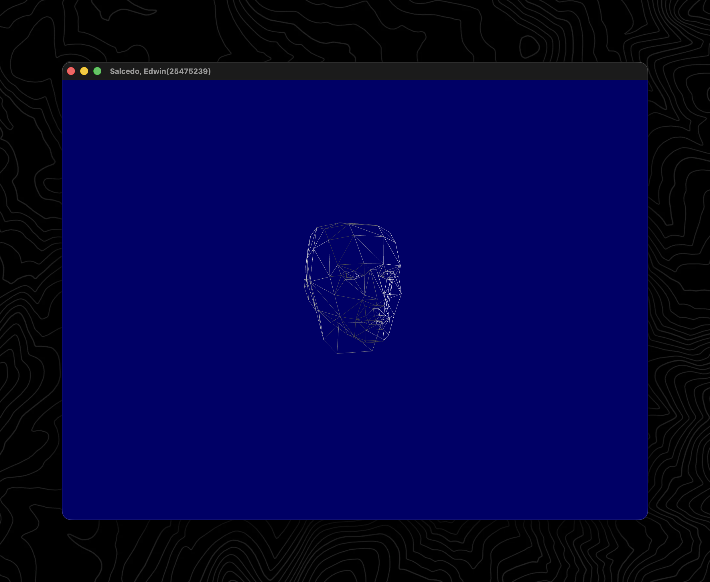
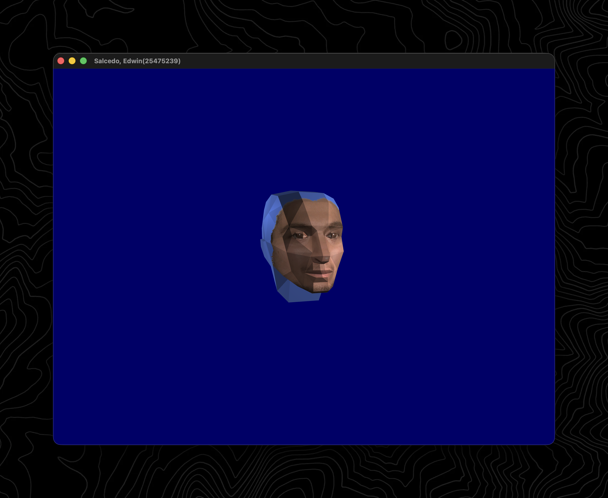

### Need CMake to build. Follow these steps to build on your machine (<https://www.opengl-tutorial.org/beginners-tutorials/tutorial-1-opening-a-window/#building-the-tutorials>)
### Once you have the project running, you can press 'F' to toggle the wireframe mode and press 'G' to toggle the face texture.

### 3D model viewer also allows for rotating the camera around the head
